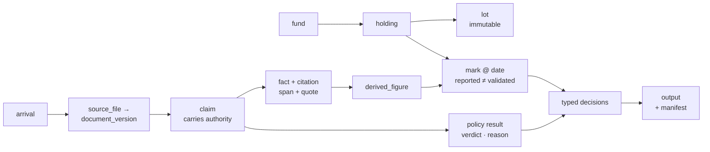
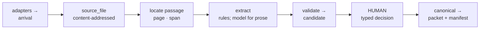

# 7GC OS — Blueprint

7GC OS is a **ledger of cited facts** with a pluggable policy layer and typed
human decisions on top. Every workflow on the menu is the same question under a
different policy: *what do we assert, at what date, and what supports it?* The
chosen function, **#7 Audit support**, is one instantiation of the six layers
below — not the shape of the platform.

**In fund valuation a wrong number is plausible**: it renders, it reconciles to
itself, it passes every type check. So the model is built on distinctions that
must not collapse, each behind a guard that can go red.

---

## 1 · Core data model

| Layer | Shared entities | What a function parameterises |
|---|---|---|
| **Positions** | `fund · holding · lot` | nothing |
| **Assertions** | `mark @ date` — reported ≠ validated | what is asserted |
| **Evidence** | `arrival → source_file → version → claim → fact → citation` | nothing |
| **Policy** | requirement set → `verdict · reason_code · next_action` | **the requirement set** |
| **Decisions** | typed approvals, append-only, content-fingerprinted | **which decision types exist** |
| **Output** | versioned artefact + manifest, reproducible | the artefact |

Two layers never change; the other four are where a workflow is defined. Audit
support fills Policy with R1–R5 and Decisions with four approval types — nothing
in the spine knows an auditor exists. An assertion separates **reported** from
**validated**, plus a third fact: whether anything supports it. This corpus holds
a position that reproduces its arithmetic perfectly and has no evidence at all,
and one "value" field cannot say that.

---

## 2 · Ingestion for fragmented sources

The pack is deliberately messy: two spreadsheets whose totals disagree with their
own columns, and 20 documents across 14 companies of which **only 4 are
executed** — the rest pro forma cap tables, unexecuted drafts, term sheets,
press, and one company with no documents at all.

**One intake pipe, many transports.** Every adapter has one job: produce a
`source_file` keyed by content hash, so re-delivery is idempotent for free. The
*arrival* is recorded separately — byte-identical documents from two senders are
the same bytes and not the same provenance.

**Authority never travels on the envelope.** Email is a container: one carries an
administrator statement, another a company-confirmed cap table, a third an
ordinary communication. Authority sits on the **claim**, so a classifier mapping
all email to one class cannot pass every downstream check while turning a
position's strongest evidence into its weakest.

**Grounding is a span, not a context window.** Every figure carries the passage
stating it — `substring(canonical_text, span) = quote`, checked in Python and
again by a database trigger, so a citation that does not resolve is refused
rather than stored. At 20 documents the extractors read each one whole;
retrieval is built to layer 2 — SQL filter → Postgres FTS → a declared rerank
whose leading dimension is the authority lattice, not a score — and is measured
both ways: 40/40 entity-scoped, 24/40 blind at top-5, which is what the ranker
is worth. Embeddings wait on the trigger in the scope note. Orchestration is
deterministic rather than an agent swarm for the same reason: a packet that
cannot be reproduced step for step is not audit evidence.

**What ingestion refuses to do matters as much.** When two sources disagree,
neither overwrites the other: the disagreement becomes a finding carrying both
figures and what to request — 32 against the real workbooks, 17 at the six audit
measurement dates. A failed join reports itself, because a silent one is how a
feeder position went missing from every Fund I total. And a new version
*invalidates* the approvals built on it: a document arriving Tuesday can
invalidate an output published Monday.

---

## 3 · Three functions on the same six layers

| | **#7 Audit support** *(built)* | **#4 Quarterly reports** | **#6 Waterfall** |
|---|---|---|---|
| **Policy** | R1–R5 sufficiency matrix | period close, prior-period comparison | distribution tiers, preferred return, carry |
| **Decisions** | 4 approval types | period close approval | model approval before LP-facing |
| **Output** | auditor packet + manifest | quarterly report | distribution schedule |
| **Asks** | *what supports this mark?* | *what did we hold, and at what value?* | *who gets what from this exit?* |

**Quarterly reports are already half-built as a side effect.** The system ingests
**12 fund-periods** and packets only **6**; the other six are `lineage_only`
because the auditor did not ask about them — and those are the quarterly dates.
Same assertions, same typed totals, same lineage; only the policy changes.

**Waterfall runs on the Positions layer** — immutable acquisition facts and
proceeds decomposed rather than netted. The corpus carries one fully modelled
realisation (Jackpocket, May 2024) with gross, holdback, withholding and net as
separate cited facts, precisely because a waterfall cannot be computed from the
netted figure. The rule governing an audit total governs a distribution: **a
total must say what it is a total of.**

The rest of the menu lands the same way — deal flow adds a pipeline entity beside
`holding`, outreach reuses the draft-then-human-sends path — but needs one thing
these do not. Here every intermediate state is already a domain fact, so the
database is the checkpoint and a run is stateless; outreach cadence ("follow-up 2
of 4, next touch Thursday") is process state no ledger row wants, and a run that
pauses days awaiting a reply is what a durable workflow engine is for.

*The letter covers Fund II only; we apply the same categories to Fund I, because
a platform that works for one fund is a script.*

---

## 4 · Where AI operates, and where a human reviews

One platform rule, enforced in the schema rather than per workflow: **AI output
is always a `candidate`. Only a recorded human decision promotes it, and nothing
becomes investor-facing without a typed decision naming what was decided.**

| Flow | AI does | Constrained by |
|---|---|---|
| Ingestion, all functions | classify documents; extract facts from prose; rerank passages | patterns first; temp 0; content-hash cache; fails closed on schema violation |
| Audit support | draft the assessment the letter asks *management* to author | draft only; human-edited before it closes the requirement |
| Quarterly reports | nothing — the figures are the same typed totals | no model call in the reporting path |
| Waterfall | **nothing.** Distribution arithmetic is deterministic over immutable lots | a model that "helped" here would be inventing money |
| Outreach · signals | draft an evidence request or an investor update | **never sent** — an invariant, not a setting |

AI does **not** compute a total, decide a verdict, choose policy precedence,
resolve a conflict between claims, or approve anything. One trigger has fired:
no pattern reads Lucra's CEO email, so a model proposed five figures from it
and the citation binding accepted three — the model returns a quote and a
value, never an offset, so a hallucinated passage or a misattached figure is a
refusal rather than a row, and the call is recorded and replayed, never live in
CI. The restatement route beside it may restate the record and never add to
it, and it is off unless the deployment says otherwise.

Audit support instantiates the decision layer with four types, **none implying
another**: approving *that a number was transcribed faithfully* and approving
*that it is fair value* are different acts.

| Decision | Prerequisite | Unlocks |
|---|---|---|
| `transcription_approval` | the citation resolves | gap and reconciliation sections — **never fair value** |
| `valuation_approval` | every applicable requirement `sufficient` | entry to an approved fair-value total |
| `management_assessment_approval` | a draft exists **and was human-edited** | closes the calibration requirement |
| `packet_approval` | every applicable lower decision exists | export |

Anthropic's 25Q4 mark of $8,000,000 takes a transcription approval and appears as
`NO_PRIMARY_PPS_SUPPORT` in the gap section; it takes no valuation approval, so
it never enters an approved total, and the packet still shows it. Approvals bind
content, not names — each is fingerprinted to a revision, an evidence-set hash
and a policy version. Audit's four types are the most elaborate case because the
packet carries the most claims, **not** because it is the most sensitive: the
LP-facing outputs are.

---

*Built, deployed and enforced: contract, invariants, gate, tracker ingestion,
document extractors (rules, plus a model behind the citation binding),
retrieval to layer 2, policy layer, packet API and export, read-only UI, and a
restatement route that cannot add to the record. Transport adapters, embeddings
and the #4/#6 policy layers are designed, not built — `docs/ROADMAP.md` carries
each with its trigger.*
